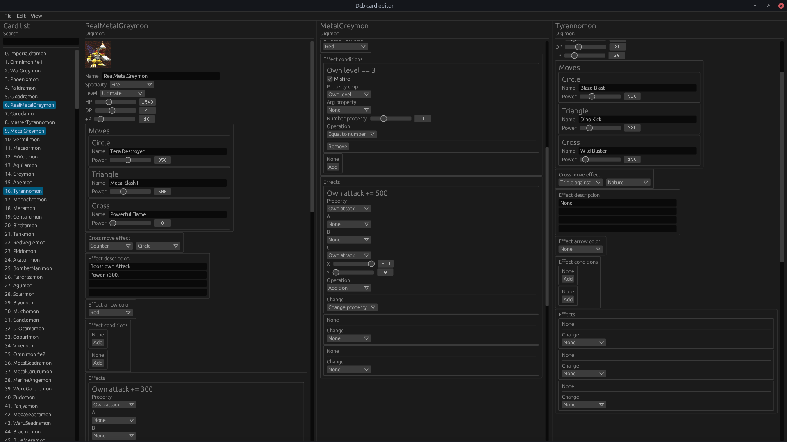
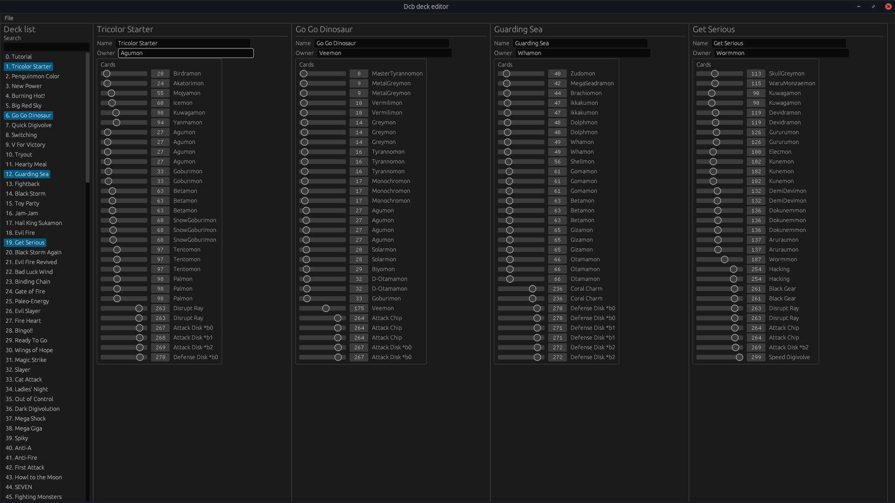

# Dcb

Collection of rust libraries and binaries used to interact with the PS1 game [`Digimon Digital Card Battle`](https://en.wikipedia.org/wiki/Digimon_Digital_Card_Battle).

# Binaries

## **dcb-card-editor**

A card editor for the game.



### Features

- Change properties of all digimon, items and digivolves:
  - Name
  - Speciality
  - Level
  - HP
  - DP
  - +P
  - Moves
    - Name
    - Power
  - Cross move effect
  - Effect description
  - Effect arrow color
  - Effect conditions (both available conditions)
    - Misfire if condition isn't met
    - Check digimon properties against a property or constant
  - Effect
    - Change digimon property to a value with an equation possibly including other properties and constants
    - Use attack (both player and opponent)
    - Move cards from a slot to another (only certain combinations are allowed)
    - Shuffle online deck of player or opponent
    - ... More, including all effects the game supports!

- Export changes for others to apply to their games
  - Changes may be exported as json and shared.
 
- Edit multiple cards simultaneously

- Check the differences from 2 games with the `Diff` tool.

### [Windows download](https://github.com/Zenithsiz/dcb/releases/tag/card-editor-0.1.4)

## **dcb-deck-editor**

A deck editor for the game.

*Warning: Still somewhat primitive*



### Features

- Change what cards each deck is made of
  - (Currently only supports setting a card via it's id).

- Export changes for others to apply to their games
  - Changes may be exported as json and shared.
 
- Edit multiple decks simultaneously

*Warning: Editing the cards while editing a deck will **not** update the deck viewer*

### [Windows download](https://github.com/Zenithsiz/dcb/releases/tag/deck-editor-0.1.0)

## + Others

Other binaries are found in `dcb-tools`, although most will be command line tools to help pack or unpack the
game files into other format.


# Libraries

The project is split into several libraries, although most of these aren't necessarily tied
to the `dcb` game and may split off into their own repositories / packages eventually.

## `dcb`

Library that implements the game logic, such as the cards and decks

## `dcb-bytes`

Library for a `Bytes` interface, used to serialize and deserialize various
game components.

## `dcb-bytes-derive`

Library for `dcb-bytes` to derive `Bytes` via several macros

## `dcb-cdrom-xa`

Library to interact with `CD-ROM/XA Mode 2 Form 1` `.bin` type files, which
the game is contained within.

## `dcb-drv`

Library to interact with the `.drv` files found within the game disc. These
are filesystems which contain the proper game files.

## `dcb-exe`

Library to interact with the game code within the `SLUS_013.28` file containing
all of the game code.
Contains a full implementation of the `mips r3000` assembly variant for the psx, as well
as several helpers to find functions and data hiding within the binary.

## `dcb-io`

Library that uses several other components to provide a direct and easy way to access
the game file, given all of of it's layers.

## `dcb-iso9660`

Library to help parse the `iso9660` filesystem the game is stored within.
Not currently used, as the filesystem is complicated.

## `dcb-pak`

Library used to interact with the `.pak` files within the game files

## `dcb-tim`

Library used to interact with the `.tim` files within the game files

# Game structure overview

The game has the following structure

```
`game.bin` (CdromXA)
└── `game.iso` (Iso9660 filesystem)
	├── A.DRV
	│	└── ...
	├── B.DRV
	│	├── CARD2.CDD (Cards file)
	│	├── DECK2.DEK (Decks file)
	│	└── ...
	├── C.DRV
	│	└── ...
	├── DIGIMON.MOV
	├── E.DRV
	│	└── ...
	├── F.DRV
	│	└── ...
	├── G.DRV
	│	└── ...
	├── MMM.DAT (Empty, likely used for padding)
	├── P.DRV
	│	└── ...
	├── SLUS_013.28 (Code)
	└── SYSTEM.CNF
```